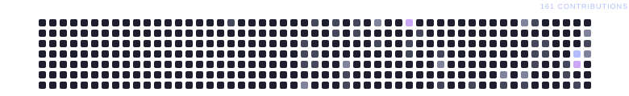

~~~aura width=860 height=730
(function() {
  var bannerLanguages = ['TypeScript', 'JavaScript', 'Next.js', 'React', 'Node.js'];
  var stackColors = ['#89b4fa', '#f9e2af', '#a6e3a1', '#f5c2e7', '#fab387', '#cba6f7'];
  var stats = [
    { label: 'Repos', value: String((github && github.stats && github.stats.totalRepos) || 0) },
    { label: 'Stars', value: String((github && github.stats && github.stats.totalStars) || 0) },
    { label: 'Forks', value: String((github && github.stats && github.stats.totalForks) || 0) },
    { label: 'Commits', value: String((github && github.stats && github.stats.totalCommits) || 0) },
  ];
  var languages = (github && github.languages && github.languages.length > 0)
    ? github.languages.slice(0, 6)
    : [
        { name: 'TypeScript', percentage: 38 },
        { name: 'JavaScript', percentage: 28 },
        { name: 'Python', percentage: 15 },
        { name: 'CSS', percentage: 10 },
        { name: 'HTML', percentage: 6 },
        { name: 'Other', percentage: 3 },
      ];
  return (
    

      

      <svg width="860" height="730" style={{ position: 'absolute', top: 0, left: 0 }}>
        <defs>
          <pattern id="aura-grid" width="30" height="30" patternUnits="userSpaceOnUse">
            <path d="M30 0H0V30" fill="none" stroke="rgba(180,190,254,0.045)" strokeWidth="1" />
          </pattern>
          <radialGradient id="aura-purple" cx="50%" cy="50%" r="50%">
            <stop offset="0%" stopColor="rgba(203,166,247,0.38)" />
            <stop offset="55%" stopColor="rgba(203,166,247,0.13)" />
            <stop offset="100%" stopColor="rgba(203,166,247,0)" />
          </radialGradient>
          <radialGradient id="aura-blue" cx="50%" cy="50%" r="50%">
            <stop offset="0%" stopColor="rgba(137,180,250,0.2)" />
            <stop offset="100%" stopColor="rgba(137,180,250,0)" />
          </radialGradient>
        </defs>
        <rect width="860" height="980" fill="url(#aura-grid)" />
        <ellipse id="aura-glow-1" cx="160" cy="280" rx="330" ry="240" fill="url(#aura-purple)" />
        <ellipse id="aura-glow-2" cx="730" cy="130" rx="280" ry="220" fill="url(#aura-blue)" />
        <ellipse id="aura-glow-3" cx="430" cy="370" rx="260" ry="180" fill="url(#aura-blue)" opacity="0.36" />
        <ellipse id="aura-glow-4" cx="560" cy="760" rx="320" ry="220" fill="url(#aura-purple)" opacity="0.22" />
        <ellipse id="aura-glow-5" cx="220" cy="790" rx="210" ry="160" fill="url(#aura-purple)" opacity="0.28" />
        <path d="M25 55V27H53" fill="none" stroke="rgba(180,190,254,0.58)" strokeWidth="2" />
        <path d="M807 925H835V897" fill="none" stroke="rgba(180,190,254,0.58)" strokeWidth="2" />
        <circle cx="86" cy="83" r="2" fill="rgba(180,190,254,0.55)" />
        <circle cx="766" cy="177" r="2" fill="rgba(180,190,254,0.45)" />
      </svg>

      

        Jean Patrick
        {bannerLanguages.join(' · ')}
        SOFTWARE ENGINEER · COMPUTER ENGINEERING STUDENT
        

          {bannerLanguages.map(function(language) { return {language}; })}
        

      

      

        {stats.map(function(stat) { return 
{stat.value}{stat.label.toUpperCase()}
; })}
      

      

        STACK ANALYTICS
        

          {languages.map(function(language, index) { return 
; })}
        

        

          {languages.map(function(language, index) { return 
{language.name}{String(language.percentage) + '%'}
; })}
        

      

      

        

          ACTIVITY PULSE
          LAST 12 MONTHS
        

        
      

      

        LET'S CONNECT
      

      

        BUILD · LEARN · SHARE
      

    

  );
})()
~~~
